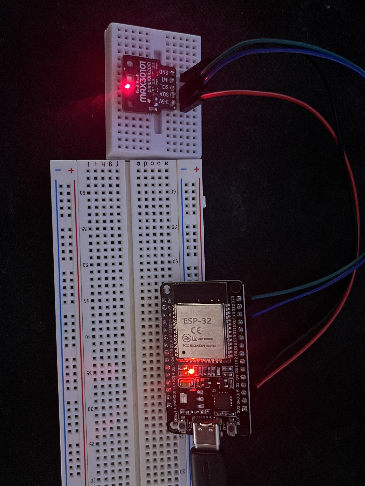
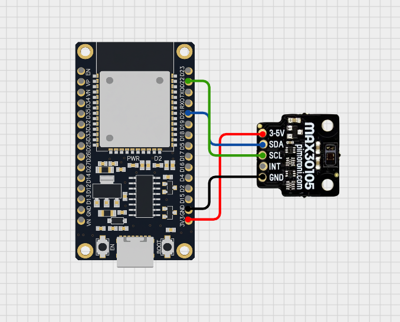
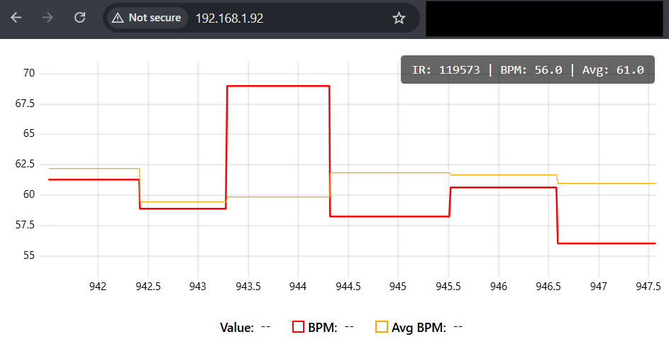

# Photoplethysmography
Using light to detect various health metrics!

In this project, I wanted to learn a few things about embedded sensors and apply processing to live collected data.

For this project, I have created a simple **ESP32** and **MAX30102** circuit with a few objectives.

## Goals
1. Learn how to solder.
2. Brush up on C++ in context of embedded programming.
3. Integrate multiple technologies (`python`, `JavaScript`, etc.) into nice embedded stack.
4. Apply some real-time health analytics + ML (later).
5. Develop something fun!

## Images
Circuit overview with the ESP32 and MAX30102 wiring.

Schematic diagram of the circuit connections (made with Cirkit Designer).

Web interface for live PPG visualization.

